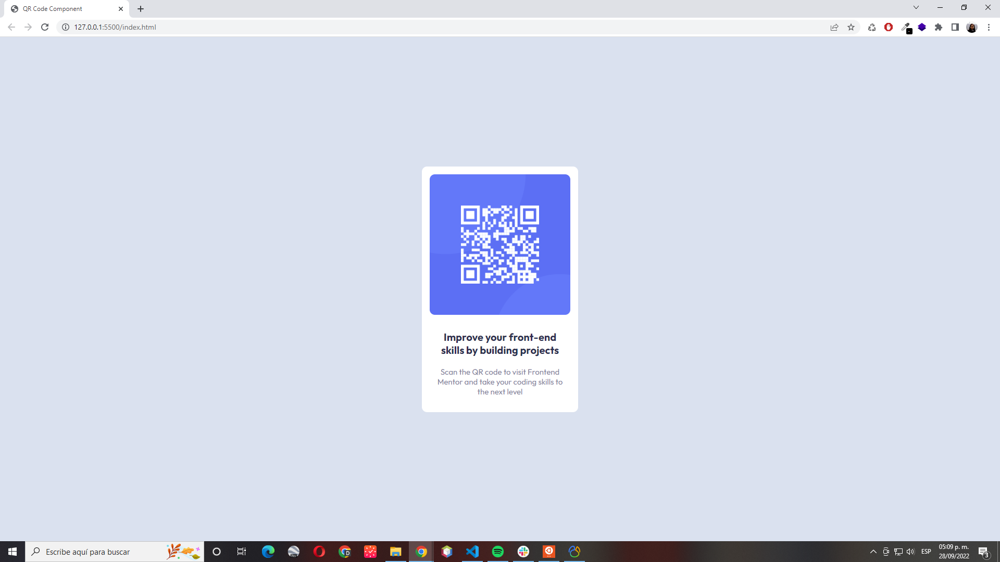

# Frontend Mentor - QR code component solution

This is a solution to the [QR code component challenge on Frontend Mentor](https://www.frontendmentor.io/challenges/qr-code-component-iux_sIO_H). Frontend Mentor challenges help you improve your coding skills by building realistic projects. 

## Table of contents

- [Overview](#overview)
  - [Screenshot](#screenshot)
  - [Links](#links)
- [My process](#my-process)
  - [Built with](#built-with)
  - [What I learned](#what-i-learned)
- [Author](#author)

## Overview

### Screenshot

In the Screenshot you can see my result.

### Links

- Solution URL: [https://github.com/samujm/QRcodecomponent](https://github.com/samujm/QRcodecomponent)
- Live Site URL: [https://samujm.github.io/QRcodecomponent/](https://samujm.github.io/QRcodecomponent/)

## My process

### Built with

- Semantic HTML5 markup
- CSS custom properties
- Flexbox

### What I learned

Whit this proyect I learned to undestand the function and concept the box model because the excercise include element inside other elements and margin, padding and other concepts.

## Author

- Website - [Samantha González Zaragoza](https://github.com/samujm)
- Frontend Mentor - [@samujm](https://www.frontendmentor.io/profile/samujm)
- Twitter - [@SamujmDev](https://twitter.com/SamujmDev)
